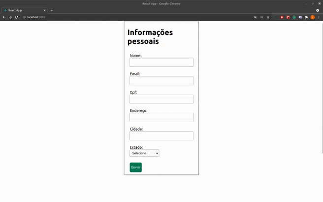

# Exercício de fixação
Vamos criar formulários utilizando `Redux`! \o/
# Antes de iniciar

Crie um fork desse projeto e para isso siga esse [tutorial de como realizar um fork](https://guides.github.com/activities/forking/).

Após feito o fork, clone o repositório criado para o seu computador.

Rode o `npm install`.

Vá para a branch master do seu projeto e execute o comando:

`git branch` ou `git branch -a`

Verifique se a a branch `master` apareceu:

* O exercício deverá ser feito na branch `master`.

Observe o que deve ser feito nas instruções.

Após a solução dos exercícios, abra um PR no seu repositório forkado e, se quiser, mergeie para a master, sinta-se a vontade!

**Atenção**! Quando for criar o PR você irá se deparar com essa tela:

É necessário realizar uma mudança. Clique no base repository como na imagem abaixo:

Mude para o seu repositório. Seu nome estará na frente do nome dele, por exemplo: `antonio/forms-redux`. Depois desse passo a página deve ficar assim:

Agora basta criar o PULL REQUEST clicando no botão `Create Pull Request`.

Para cada PR realize esse processo.

---

# COMEÇANDO O EXERCÍCIO

**Atenção**! A branch `master` possui a estrutura do formulário pronta, necessitando apenas da implementação do Redux. Se preferirem criar os formulários desde o início, basta acessar a branch `exercise-react-redux` e seguir as instruções descritas no README.

Vocês implementarão o Redux para dois formulários, cada um em uma etapa, um para dados pessoais e outro para dados profissionais e exibí-los na tela.

Lembrando que os formulários já estão criados, não é necessário criar novos arquivos além dos propostos para a execução do exercício.

Para isso, é preciso salvar as informações de cada formulário no gerenciador de estados e, por fim, numa outra página, acessar esses dados para que sejam renderizados.

Você vai precisar de:

* Gerenciador de estados (Reeeedux), para salvar as informações na `store` e também para acessá-las.

Então, mãos ao código!!

**1 - Implemente o Redux:**
- Dentro de uma pasta "redux", crie as pastas "actions", "reducers" e "store".
- Dentro de "actions" crie um arquivo chamado `action.js`.
- Dentro de "reducers" crie um arquivo chamado `reducer.js` e, caso necessário, um arquivo `index.js` para usar o `combineReducers`.
- Dentro de "store" crie um arquivo chamado `store.js`.
- Implemente o `reducer`.
- Implemente a `store`.
- Implemente as `actions`.

**Dicas:** 
- De início, você pode implementar seu reducer apenas com o valor `default`.
-  O `composeWithDevTools` pode te ajudar.

_Lembre-se que, ao montar a estrutura do Redux, é preciso importar o `Provider`, que recebe a `store`, no `index.js`._

**Dica:** Caso esteja tendo dificuldades para montar a estrutura do Redux, você pode consultar o passo a passo que está nesse [link!](https://app.betrybe.com/course/front-end/gerenciamento-de-estado-com-redux/usando-o-redux-no-react/a2dac445-434c-4690-83da-7ebef1aad2cd/conteudos/cfc29dbb-9243-4450-baa6-6da6ac0d0674/fluxo-de-dados-no-redux/4341ae67-1e44-4a06-84dc-0f1f87a56f0f?use_case=side_bar)

_Lembre-se de fazer as importações corretas para o bom funcionamento da sua aplicação._

**2 - Salve as informações das páginas `PersonalForm` e `ProfessionalForm` na `store`.**

**Dica:** Lembre-se que o `mapStateToProps` lê as informações da `store` e o `mapDispatchToProps` envia as informações para a `store`.

**3 - Renderize, em `FormDataDisplay`, todas as informações que estão salvas na `store`.**

---
